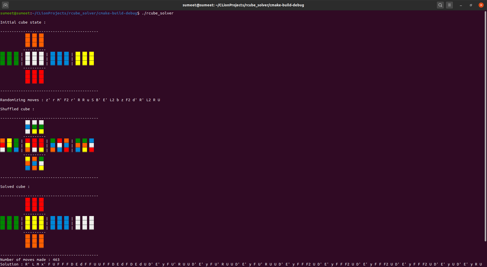

# A basic 3x3 Rubik's Cube Solver

This is a very basic 3x3 Rubik's cube solver which uses the beginner's method with a slight variation(yellow corners 
solved before yellow edges) to solve the cube. 

For details on the beginners method refer : [Beginners Method](https://ruwix.com/the-rubiks-cube/how-to-solve-the-rubiks-cube-beginners-method/)

While the steps followed to solve the cube are similar to the beginner's method, the algorithms used may differ vastly.
The reason for this is that the algorithms used here are better suited for quick memorization and not necessarily suited
for quick solves.

Average solution length ~= 410

The solution includes moves that may turn out to be superfluous as the solver user cube moves for inspecting the cube
before making actual solution moves

## Built with

[CMake](https://cmake.org/) - v3.15 

## Compile

```
rcube_solver:~$ cmake .
rcube_solver:~$ make
rcube_solver:~$ ./rcube_solver
```

## Sample Output

